# Sistem_Pakar_Penyakit_Ikan_Koki
Sistem Pakar Penyakit Ikan Mas Koki Menggunakan Java &amp; MySQL dengan IDE Netbeans

id = A01  
password = 123

1.Login  
</img> 

2.Menu Utama  
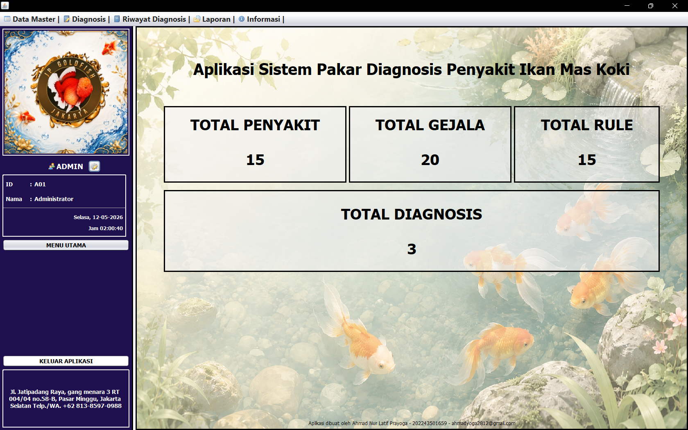</img> 

3.Master Penyakit  
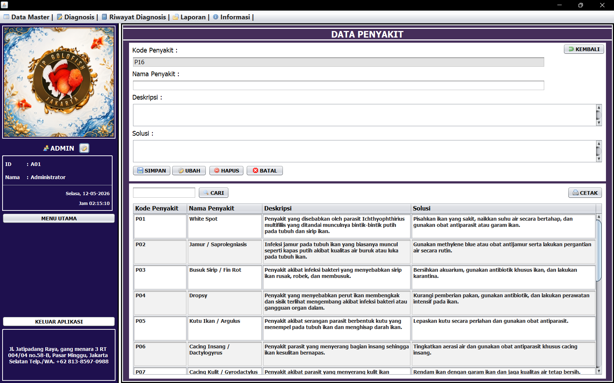</img> 

4.Master Gejala  
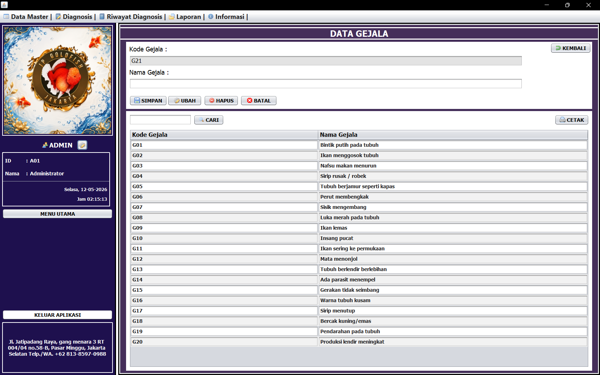</img> 

5.Master Rule  
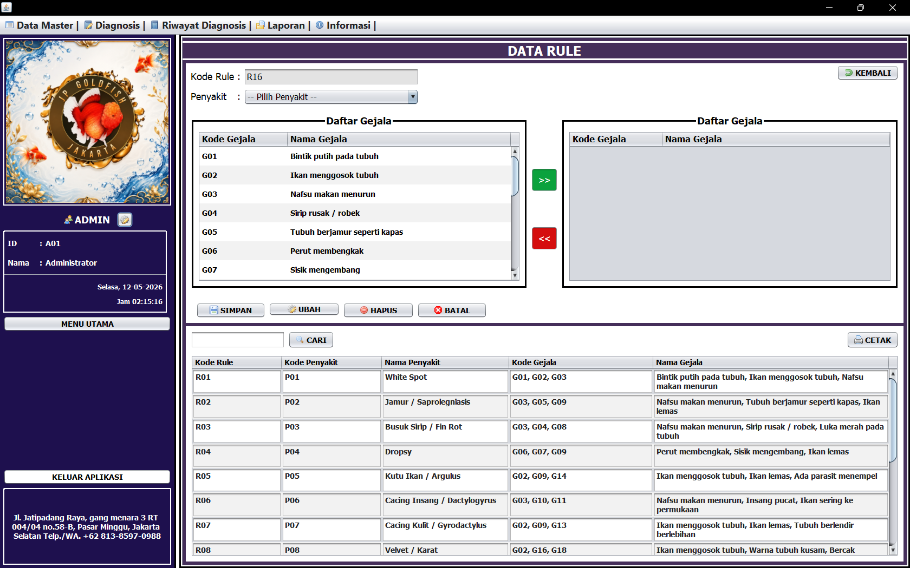</img> 

6.Diagnosis  
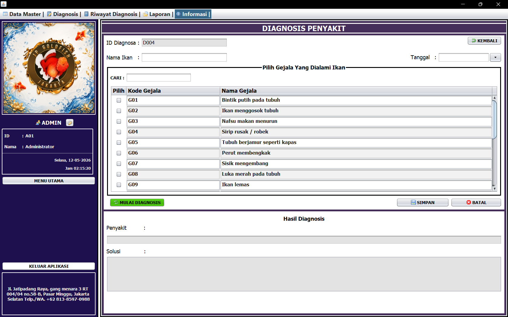</img> 

7.Riwayat Diagnosis 
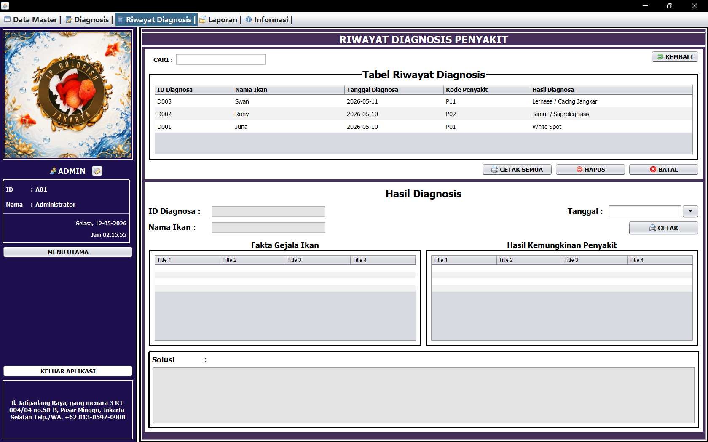</img> 

8.Laporan Data Penyakit  
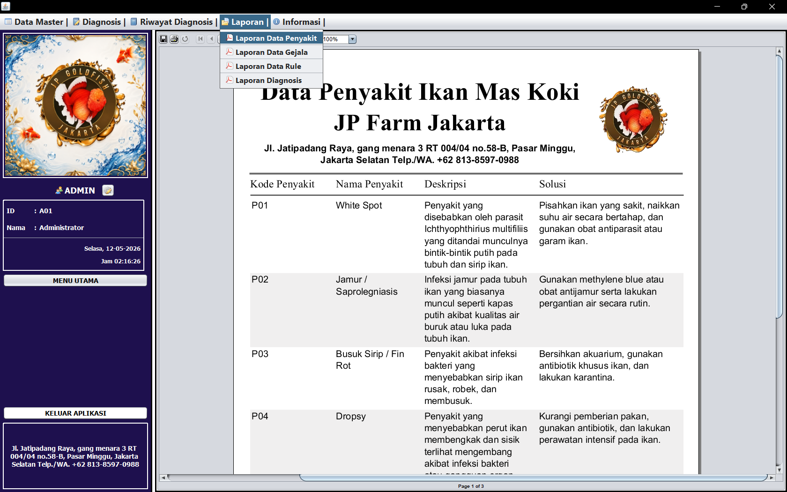</img> 

9.Laporan Data Gejala  
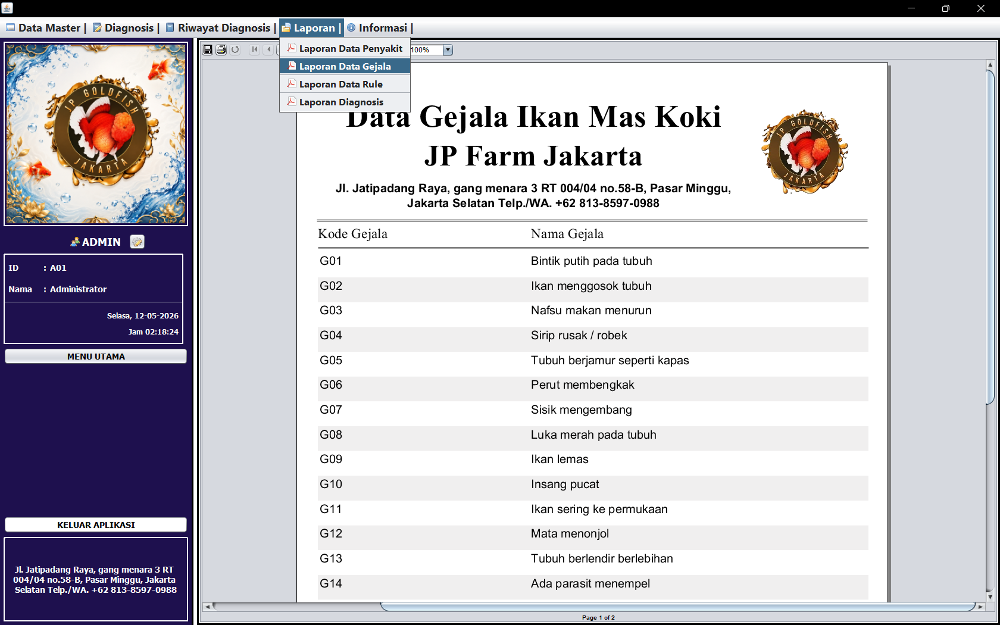</img> 

10.Laporan Data Rule  
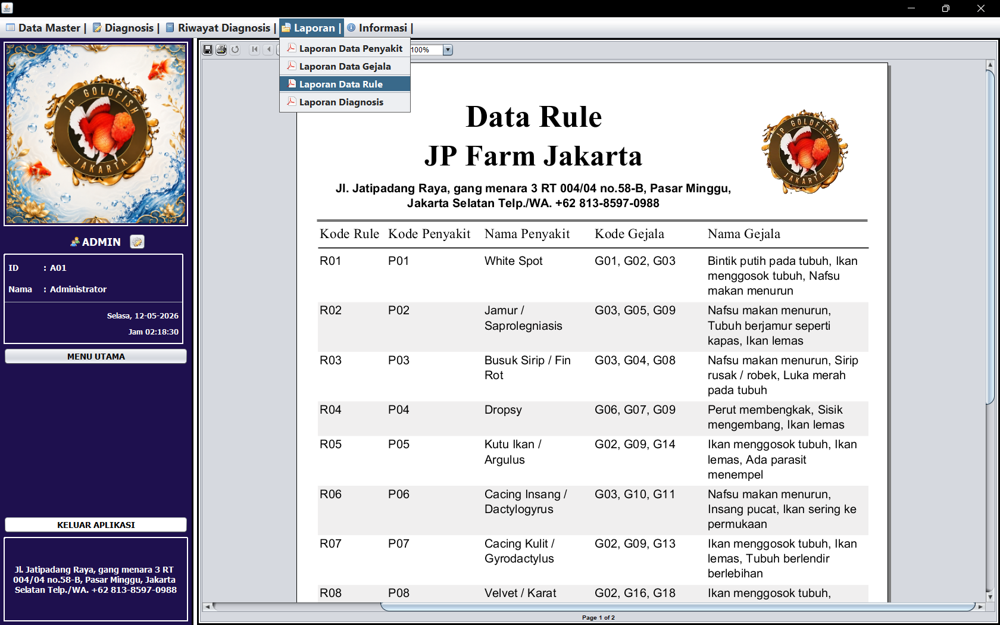</img> 

11.Laporan Diagnosis  
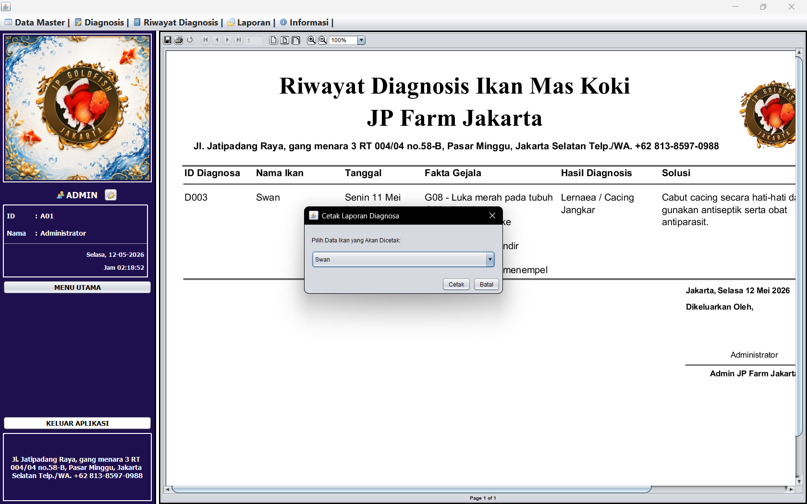</img> 

12.Admin  
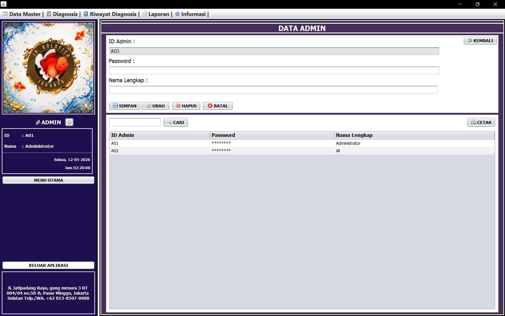</img> 
