# Sistem Pakar Diagnosis Penyakit Ikan Mas Koki


Aplikasi desktop berbasis **Java** dan **MySQL** untuk membantu proses diagnosis penyakit pada ikan mas koki. Sistem menerapkan metode **Forward Chaining** dengan mencocokkan gejala yang dipilih pengguna terhadap basis aturan (*rule base*) untuk menghasilkan diagnosis penyakit.

Proyek ini dibuat sebagai *academic project* pada studi Teknik Informatika dengan studi kasus **JP Farm Jakarta**.

## Tujuan Proyek

- Membantu pengguna mengidentifikasi kemungkinan penyakit ikan mas koki berdasarkan gejalanya.
- Menyimpan dan mengelola data penyakit, gejala, serta aturan diagnosis secara terstruktur.
- Menyediakan riwayat dan laporan hasil diagnosis untuk memudahkan pengelolaan data.

## Metode Forward Chaining

Forward Chaining adalah metode penalaran yang dimulai dari fakta awal, yaitu gejala yang dipilih pengguna. Sistem kemudian mengevaluasi aturan berbentuk **IF–THEN** secara bertahap hingga menemukan penyakit yang sesuai.

Contoh alur sederhana:

```text
Gejala dipilih → Cocokkan dengan rule → Rule terpenuhi → Diagnosis penyakit ditampilkan
```

## Fitur Utama

| Fitur | Keterangan |
| --- | --- |
| Autentikasi admin | Membatasi akses aplikasi melalui halaman login. |
| Dashboard | Menampilkan menu utama untuk mengakses seluruh fungsi sistem. |
| Master penyakit | Menambah, mengubah, menghapus, dan melihat data penyakit. |
| Master gejala | Mengelola daftar gejala yang digunakan dalam proses diagnosis. |
| Basis aturan (*rule*) | Menghubungkan gejala dengan penyakit sebagai dasar penalaran sistem. |
| Diagnosis | Menentukan kemungkinan penyakit berdasarkan gejala yang dipilih. |
| Riwayat diagnosis | Menyimpan hasil diagnosis yang telah dilakukan. |
| Laporan | Menampilkan laporan data penyakit, gejala, rule, dan hasil diagnosis. |
| Manajemen admin | Mengelola data akun administrator. |

## Teknologi yang Digunakan

- **Bahasa pemrograman:** Java
- **Jenis aplikasi:** Desktop Application
- **IDE:** Apache NetBeans
- **Database:** MySQL
- **Metode sistem pakar:** Forward Chaining

## Prasyarat

Sebelum menjalankan proyek, pastikan perangkat telah memiliki:

- Java Development Kit (JDK)
- Apache NetBeans
- MySQL Server
- MySQL Connector/J atau *driver* JDBC MySQL yang telah ditambahkan ke proyek

## Cara Menjalankan

1. Clone atau unduh repository ini.
2. Buka proyek melalui Apache NetBeans.
3. Buat database MySQL dan impor berkas SQL proyek apabila tersedia.
4. Sesuaikan konfigurasi koneksi database pada source code dengan akun dan nama database MySQL Anda.
5. Pastikan library MySQL Connector/J sudah terhubung pada proyek.
6. Jalankan proyek dari NetBeans.
7. Masuk menggunakan akun demo di bawah ini.

## Akun Demo

| Field | Nilai |
| --- | --- |
| ID Admin | `A01` |
| Password | `123` |

## Dokumentasi Antarmuka

### 1. Login

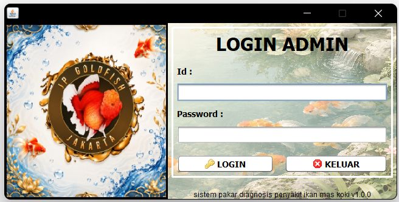

### 2. Menu Utama

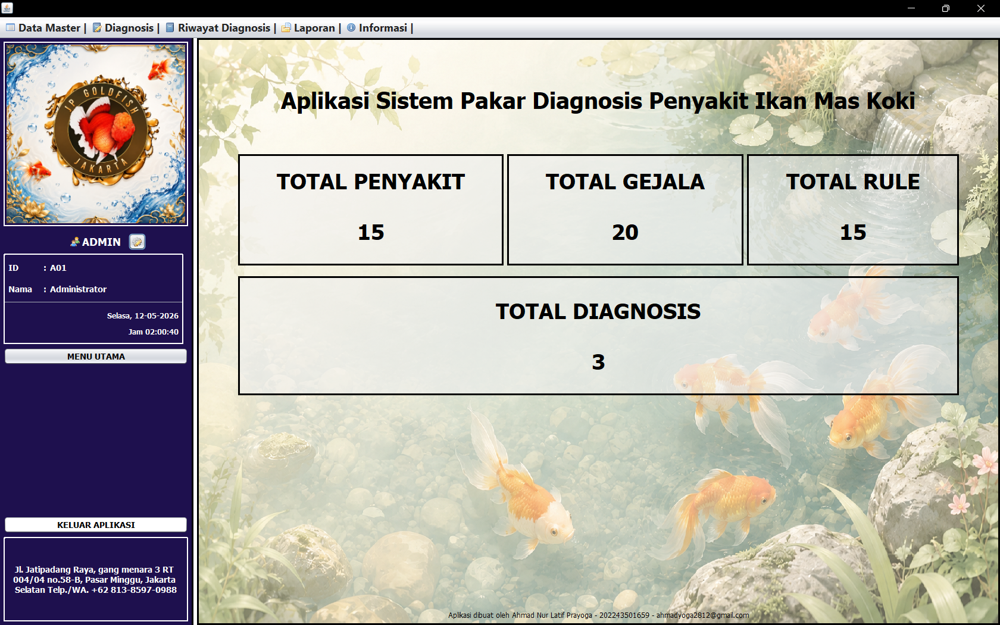

### 3. Master Penyakit

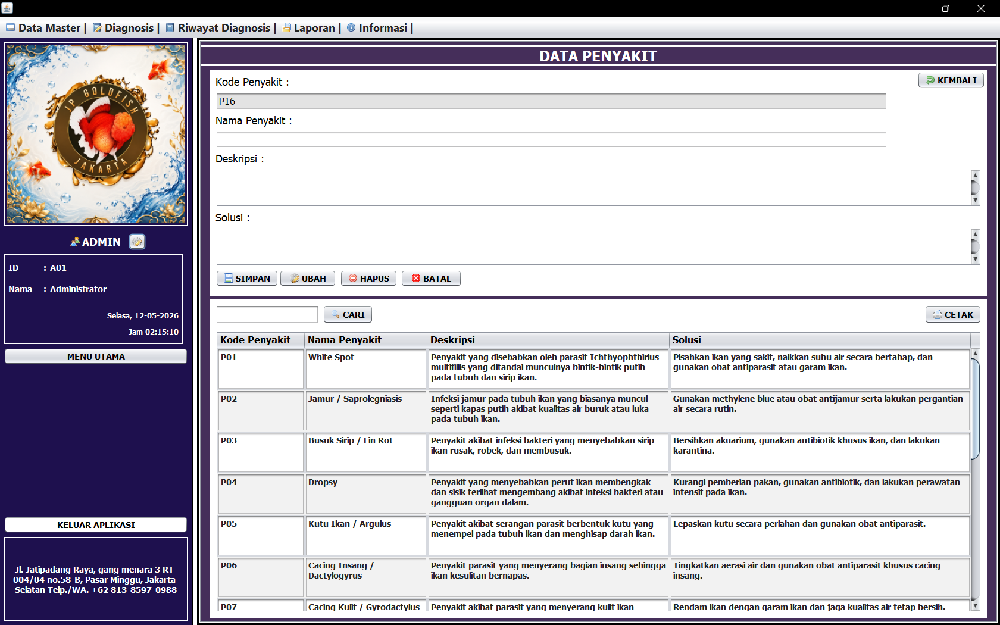

### 4. Master Gejala

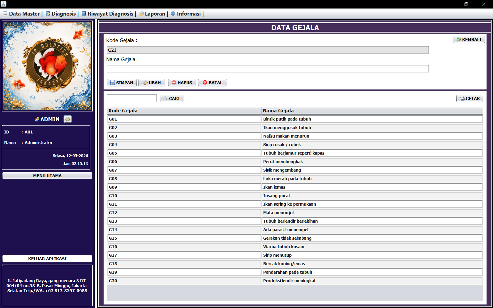

### 5. Master Rule

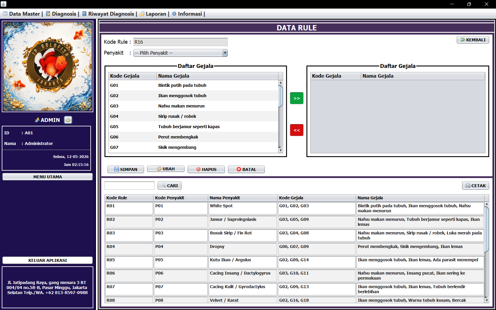

### 6. Diagnosis

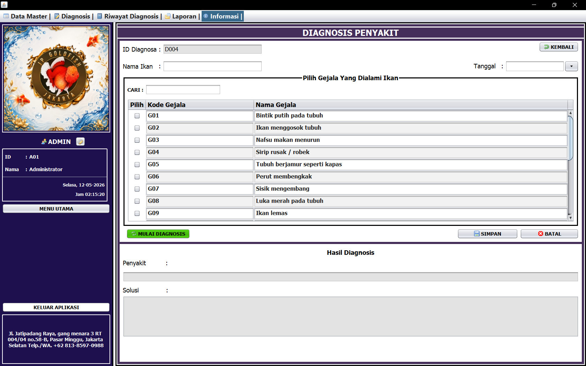

### 7. Riwayat Diagnosis

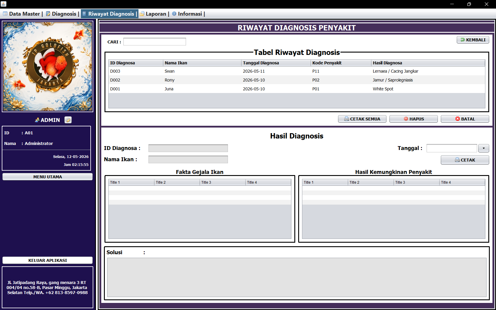

### 8. Laporan Data Penyakit

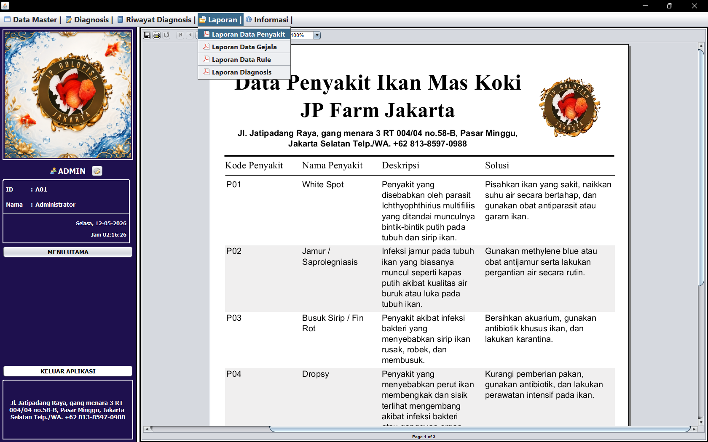

### 9. Laporan Data Gejala

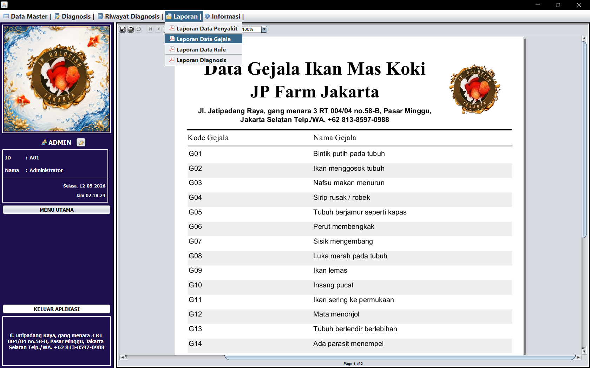

### 10. Laporan Data Rule

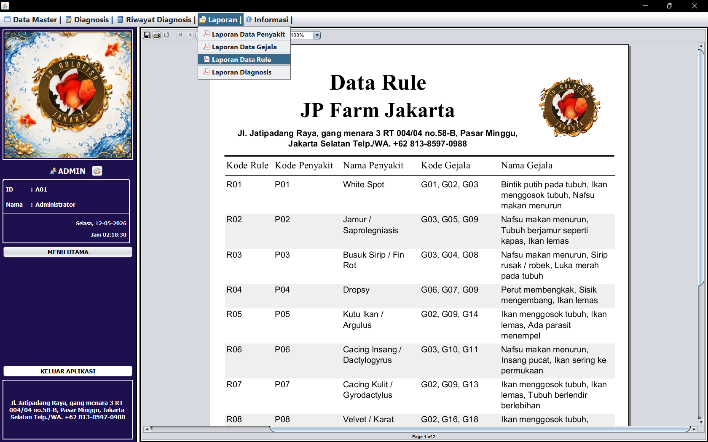

### 11. Laporan Diagnosis

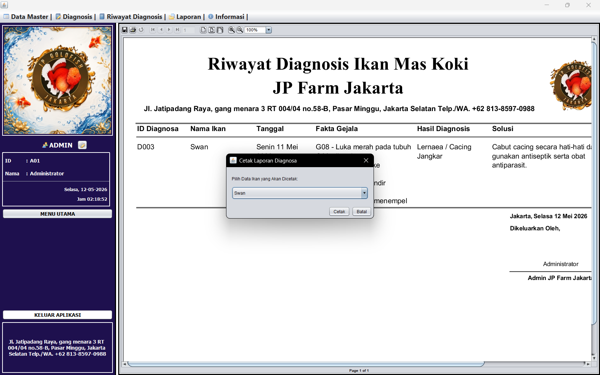

### 12. Manajemen Admin

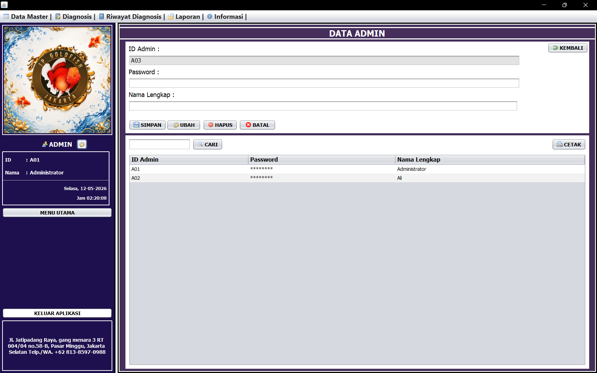

## Pengembangan Selanjutnya

Beberapa pengembangan yang dapat dilakukan pada proyek ini:

- Menambahkan rekomendasi penanganan dan pencegahan untuk setiap penyakit.
- Menambahkan tingkat kepastian diagnosis, misalnya dengan metode Certainty Factor.
- Membuat versi web atau mobile agar sistem lebih mudah diakses.

## Kontributor

**Ahmad Nur Latif Prayoga**  
Teknik Informatika — Universitas Indraprasta PGRI
